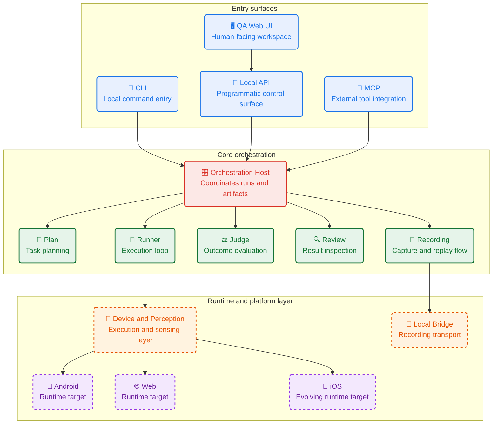

# Munk AI

> 面向 Android、iOS 与 Web 的 AI 测试引擎。

Munk AI 是一个 AI 测试引擎。

- 它通过多 Agent 协作，在真实设备和浏览器中执行测试，并返回截图、UI Tree 和运行日志等验证证据。
- Gemini 作为规划 Agent，Gemma-4 作为执行 Agent。

## 项目定位

- 参赛赛道：A - AI Agent
- 项目目标：让 AI 能够执行测试任务
- 核心方向：AI 测试引擎
- 交互方式：CLI、MCP、Local Web UI、Local API
- 执行环境：Android、iOS、Web

## 演示


演示内容：

- Trae 生成一个真实功能改动
- Munk AI 自动规划测试任务
- 在真实运行环境中执行点击、输入、滚动和校验
- 返回截图、UI Tree、运行日志等证据

演示视频：

- [Demo.mp4](./assets/Demo.mp4)
- [history.json](./assets/history.json)
- [runner_history.json](./assets/runner_history.json)

手动在 Web UI 中发起测试任务，由 Gemma 4 驱动 Munk AI 自动执行测试用例，并返回验证结果与运行证据。模拟企业级的测试流程。

运行日志示例：

- `history.json` 记录完整工作流事件，包括启动、感知、工具调用、动作执行、停止原因和 Judge 最终判定
- `runner_history.json` 记录 Runner 的关键动作轨迹，便于快速回看每一步是如何完成目标的

本次演示的关键执行轨迹如下：

```text
Step 0: 点击新增任务按钮
Step 1: 点击 Task Title 输入框
Step 2: 输入 "Test"
Step 3: 点击 Save Task
Step 4: 检测到任务 "Test" 已出现在列表中，停止执行
Judge: 判定通过，确认新任务创建成功
```

其中，`runner_history.json` 对应的动作序列为：

```json
[
  { "step_index": 0, "action_type": "click", "summary": "Tap the add task button to start creating a new task." },
  { "step_index": 1, "action_type": "click", "summary": "Tap on the 'Task Title' field to focus it for text input." },
  { "step_index": 2, "action_type": "clear_and_input", "summary": "Enter 'Test' into the Task Title field." },
  { "step_index": 3, "action_type": "click", "summary": "Tap the 'Save Task' button to save the new task." },
  { "step_index": 4, "action_type": "stop", "summary": "The new task 'Test' is visible in the task list, satisfying the objective." }
]
```

`history.json` 中还记录了更完整的运行时证据，例如：

- 感知阶段识别到的可操作元素数量与 UI Tree 状态
- Gemma 4 的工具调用与动作决策
- 动作执行后的界面变化与稳定性判断
- Judge 对最终结果的独立判定

## 我们解决什么问题

AI 写代码越来越快，但验证环节仍然高度依赖人工。

今天的大多数开发流程里，人在做这些事：

- 编译和启动项目
- 手动点击页面或 App
- 看报错、截图、抄上下文
- 再把这些问题描述回 AI

这会让 AI Coding 停在一个开环里：代码生成很快，验证却很慢。

Munk AI 的目标，就是把这个开环补成闭环。

## 为什么选择 Gemma 4

Munk AI 采用多 Agent 编排，但在高频执行环节，Gemma 4 是核心角色。

我们选择 Gemma 4，主要因为它适合承担本地、高频、低延迟的执行决策：

- 足够轻，适合本地部署或低成本调用
- 适合步级决策，能处理“下一步该做什么”这类短链路判断
- 能接收多模态感知结果，参与真实 UI 交互
- 更适合进入日常开发和回归流程，而不是只做昂贵的单次演示

在 Munk AI 中，Gemma 4 主要负责 Runner Agent，也就是执行侧的大脑。

## Gemma 4 在项目中的作用

我们把模型职责做了清晰分层：

- Gemini 负责理解长上下文，生成测试计划和评审约束
- Gemma 4 负责基于当前界面状态做高频执行决策

Gemma 4 的工作不是泛泛聊天，而是回答非常具体的问题：

> 基于当前截图、UI 结构和历史上下文，我下一步应该点哪里、输入什么、是否需要等待或重试？

这一设计让系统同时具备两个能力：

- 云端模型负责“想得深”
- Gemma 4 负责“跑得快”

## Agent 架构

Munk AI 不是单 Agent，而是一套可协作的多 Agent 系统。

主要角色包括：

- Plan Agent：把 PRD、需求描述或代码改动转成结构化测试计划
- Runner Agent：在真实设备或浏览器里执行测试步骤
- Judge Agent：基于证据独立判定是否通过
- Review Agent：结合改动和测试结果推断风险与回归范围
- Knowledge Agent：管理应用知识和可复用测试上下文

这套结构对应赛道 A 最关注的两点：多步规划，以及可落地的 Tool Calling。




## Memory 设计

Munk AI 的 Runner 不是无状态执行器，而是带记忆的 Agent。

在执行过程中，系统会保存可复用上下文，例如：

- 当前页面已经确认过的关键信息
- 某个按钮、输入框或状态的识别结果
- 上一轮失败原因
- 某次重试前的纠偏建议

这些记忆会用于后续步骤和下一次判断，减少重复观察和无效操作。

对评审来说，可以把它理解为：

- Agent 不只是“看到什么做什么”
- Agent 会把关键事实存下来，供后续步骤继续使用

## Tool Calling 设计

Munk AI 把 Agent 能力拆成一组受控工具，由模型按需调用。

以 Runner 为例，Gemma 4 会调用这类工具完成决策和执行：

- 读取目标与当前页面信息
- 列出可点击元素
- 查看某个元素的细节
- 读取上一步动作结果
- 保存和读取运行记忆
- 执行点击、输入、滚动、等待、返回等动作

这意味着，Gemma 4 在项目里并不是只输出自然语言，而是在真实执行链路中使用结构化 Tool Calling 驱动系统前进。

## 执行闭环

Munk AI 的完整流程如下：

1. 输入自然语言需求、PRD 或代码变更
2. Plan Agent 生成结构化测试计划
3. Runner Agent 在真实设备或浏览器中执行
4. Judge Agent 基于截图、UI Tree、日志等证据独立判定
5. 若失败，系统生成带上下文的重试信息
6. 若成功，沉淀为可复用的测试资产

这个闭环的关键不只是“跑起来”，而是：

- 执行和判定分离
- 失败可追溯
- 证据可复查
- 测试资产可沉淀

## 核心能力

- 自然语言转结构化测试计划
- Android、iOS、Web 跨端执行
- 真实 UI 交互，而非 mock 环境
- 截图、UI Tree、运行日志等证据输出
- 录制、回放、批量执行、调度执行
- 通过 MCP 接入 AI IDE 与 Coding Agent 工作流

## 技术亮点

- Local-first：优先本地运行，降低成本，保护隐私
- 多模型编排：云端负责规划，本地负责执行
- 多模态感知：结合截图、OCR、图标检测和 UI 结构
- 执行与判定隔离：避免“既当运动员又当裁判”
- 自我进化：把失败上下文和重试经验沉淀为更好的测试资产

## 快速开始

当前优先支持 macOS。

安装、检查环境并启动本地 Web UI：

```bash
curl -fsSL https://get.munk.sh | sh
munk doctor
munk serve --port 16888
```

启动后，你可以通过本地 Web UI 管理设备、测试计划、执行记录和证据。

更多说明请访问：

- [munk.sh](https://www.munk.sh/)

## 适合评审的最短复现路径

1. 安装 Munk AI
2. 运行 `munk doctor` 完成环境检查
3. 启动 `munk serve --port 16888`
4. 打开本地 Web UI
5. 导入测试目标并触发一次真实执行
6. 查看运行结果、证据和日志

## 仓库结构

- `src/munk/`：核心入口、编排逻辑、适配层和产物处理
- `packages/agents/*`：Plan、Runner、Judge、Review、Knowledge 等 Agent 包
- `packages/devices/*`：Android、iOS、Web 设备运行时
- `packages/shared/*`：共享协议、感知能力和跨 Agent 基础设施
- `apps/web-ui/`：本地 Web 管理界面

## 技术栈

核心运行时：

- Python 3.10
- FastAPI
- Typer CLI
- Pydantic / PydanticAI
- NumPy / OpenCV

设备执行层：

- Android：`uiautomator2`
- Web：`Playwright + Chromium`
- iOS：独立运行时集成

本地 UI 与桥接层：

- Vue 3
- TypeScript
- Vite
- Fastify
- WebSocket
- scrcpy 生态

## 当前状态

Munk AI 正在持续迭代中。

当前已具备：

- App Knowledge
- 稳定的 CLI 工作流
- 面向 Coding Agent 的 MCP 接入
- 本地 Web UI
- 批量执行与调度执行
- macOS 发布能力

## 项目愿景

代码会越来越便宜，验证会越来越重要。

Munk AI 希望解决的不是“如何再快一点写代码”，而是“如何让 AI 生成的软件拥有真实反馈闭环”。

只有验证能力建立起来，Harness Engineering 才能真正落地。

## 联系方式

- 官网：[munk.sh](https://www.munk.sh/zh)
- GitHub：[chaxiu/munk-ai](https://github.com/chaxiu/munk-ai)

## License

Apache-2.0
