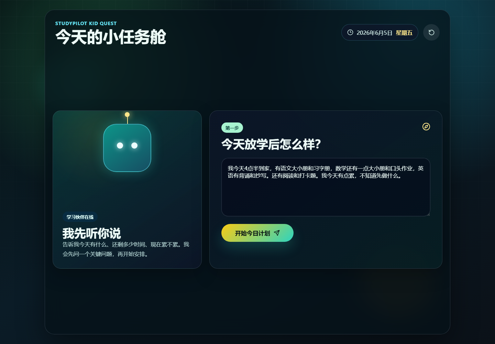
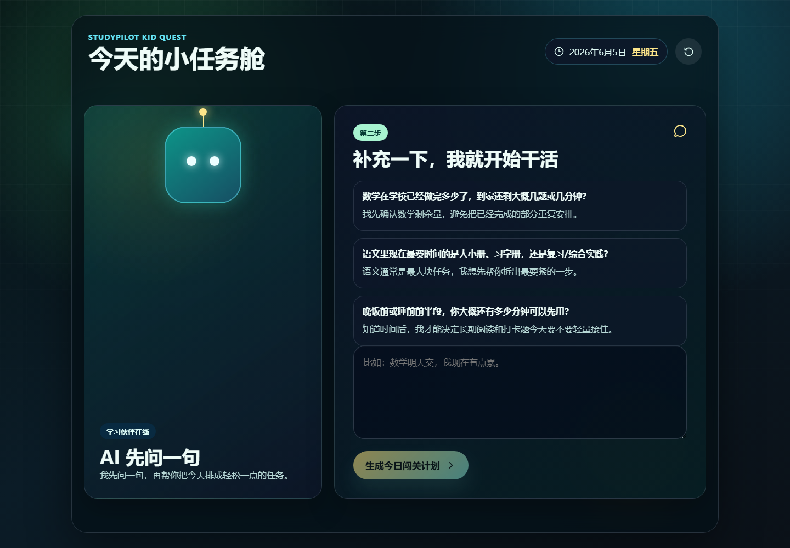
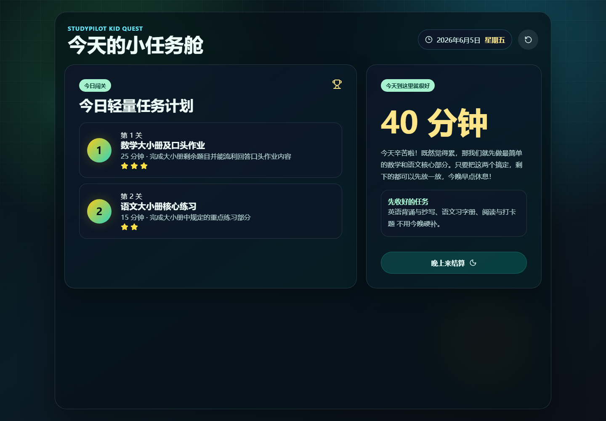
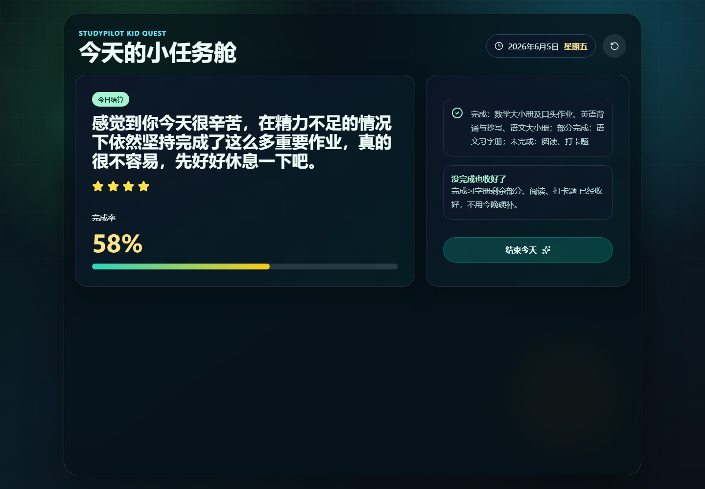
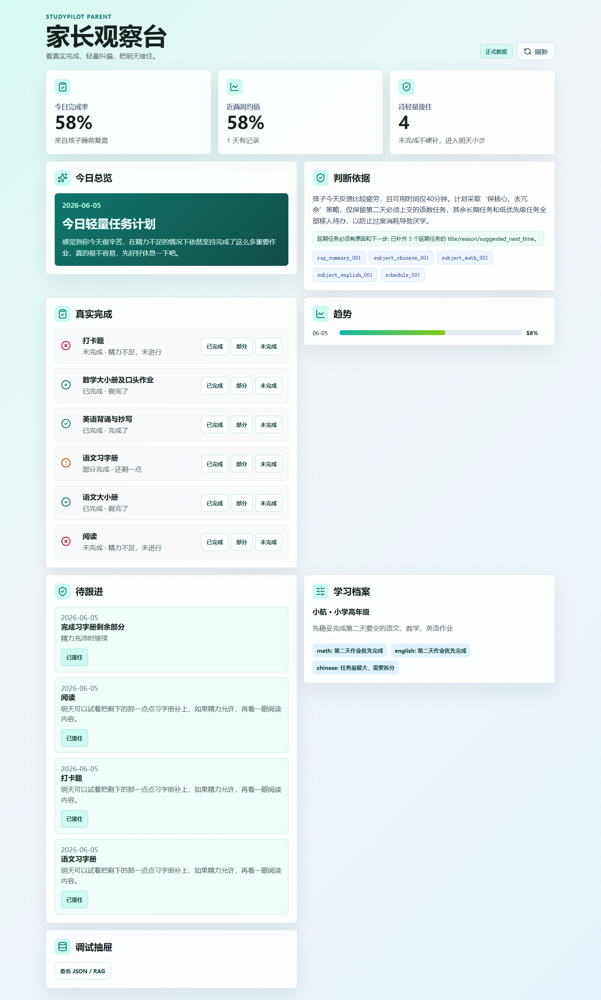
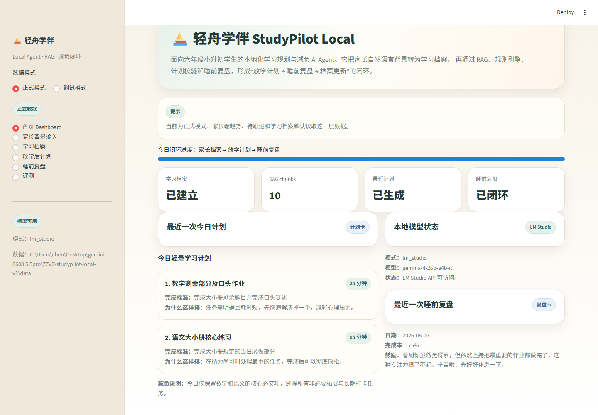

# 运行截图与验证证据

这些截图来自本地真实启动验证，用于说明一个后端、三个前端读取同一套流程和数据。

## 孩子端

首屏输入：



AI 二次反问：



今日计划：



睡前结算：



## 家长端

今日总览与真实完成：



## Streamlit 调试台

内部调试台展示模型状态、RAG、trace 和调试信息：



## 本地验证命令

```powershell
pytest -q
cd kid-frontend && npm run build
cd parent-frontend && npm run build
```

最近验证结果：

- 后端/数据层/流程测试：49 passed。
- kid frontend build：通过。
- parent frontend build：通过。

## Demo 数据一致性

同一轮真实 demo 中，孩子端结算与家长端完成率对齐为 `58%`。完成率算法统一为：

```text
completed = 1
partial = 0.5
missed = 0
completion_rate = score / task_count
```

示例任务结果：

- 数学：completed
- 英语：completed
- 语文大小册：completed
- 语文习字册：partial
- 阅读：missed
- 打卡题：missed
