# Doran AI

端侧 AI 榴莲挑选小管家。  
Google Gemma 4 Competition - Edge AI 赛道作品。

| Doran AI Logo | 榴莲示例图 |
|---|---|
|  | 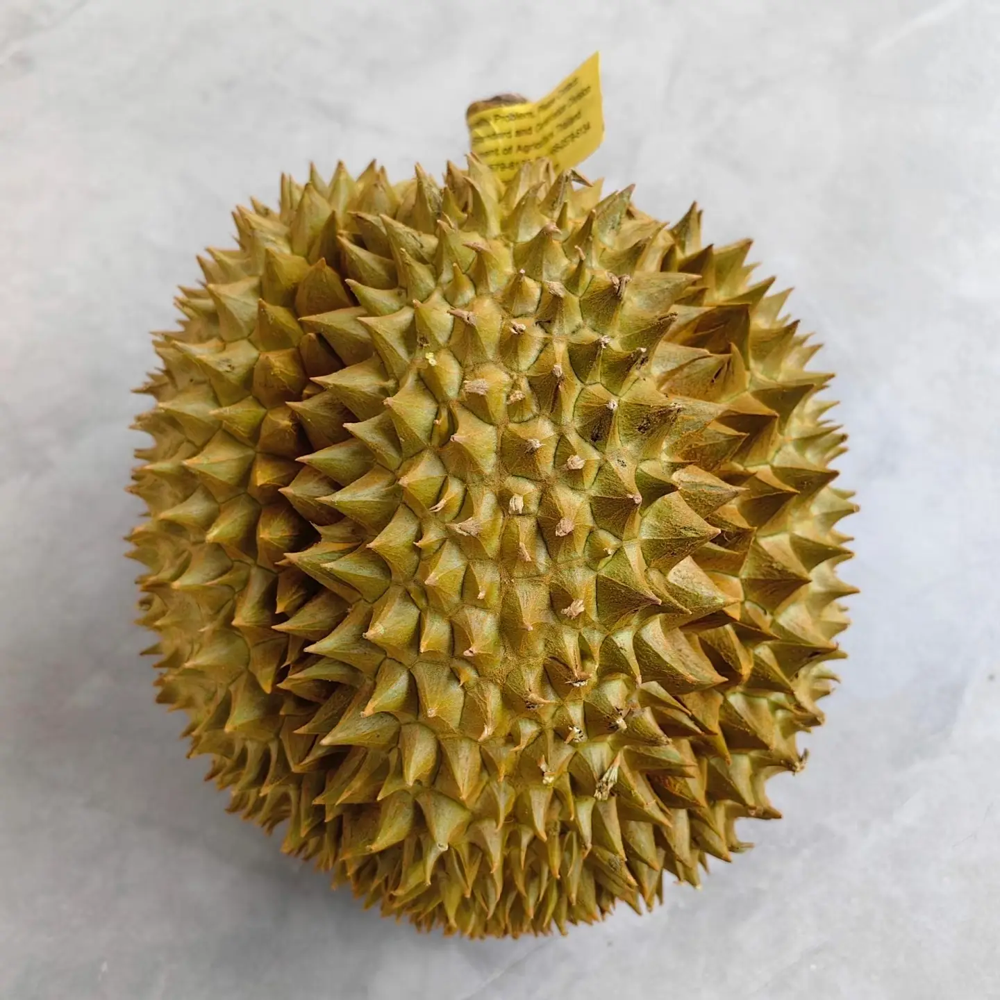 |

## 项目简介

Doran AI 是一个 Android 原生应用，使用 Kotlin、Jetpack Compose、Google ADK Kotlin 和 LiteRT-LM 构建端侧榴莲挑选 Agent。用户可以通过自然语言或表单补齐榴莲重量、房数、形态和品种，拍摄上面、下面、左侧、右侧、正面五个角度照片，然后由本地 Gemma 4 / LiteRT-LM 模型参与对话、工具调用、照片质检和分析流程编排。web介绍：https://doran-one.vercel.app

当前源码已经完成：

- 本地 `.litertlm` 模型导入、URL 下载、ADB push Demo 支持。
- LiteRT-LM 端侧推理封装，支持 CPU/GPU 后端选择和 CPU 回退。
- Google ADK FunctionTool / FunctionDeclaration 工具调用接口。
- Agent-driven UI：相机组件、参数表单、分析进度和报告卡片由 Agent 状态驱动。
- CameraX 五角度采集。
- 本地视觉模型照片质检。
- P0-P5 Demo 分析工具链、报告、历史、统计、徽章和桌面Widget组件。

当前边界：

- P1-P3 的真实图像分割、刺密度和几何计算仍为 Demo 代理值。
- P0 照片质检已调用本地视觉模型，但效果取决于导入的 `.litertlm` 是否具备视觉输入能力。

## 项目亮点

- Gemma 4 端侧调用集中在 `app/src/main/java/com/winter/durianai/data/remote/llm/LlmRepository.kt`，通过 LiteRT-LM `Engine` 加载 `.litertlm` 模型，并提供文本、视觉、音频接口。
- 对话 Agent 使用 ADK `FunctionTool` / `FunctionDeclaration` / `FunctionCall`，把模型意图映射为更新参数、请求拍照、展示表单和开始分析等 Android 原生动作。
- 多模态能力覆盖图片和音频：照片质检走 `Content.ImageFile`，音频接口通过 `AudioLlmService` 使用 `Content.AudioFile` 并放在独立进程。
- 模型文件保存在 Android App 私有目录，可通过本地导入、URL 下载或 ADB push 准备；推理支持 CPU/GPU 后端选择和自动回退。
- 文档目录包含技术报告、源码说明、照片评测方案和品种先验资料。

## 模型选型

本 Demo 优先使用 Gemma 4 2B Edge 规格的 LiteRT-LM 模型，例如根目录中的（模型未提交git仓库）：

```text
gemma-4-E2B-it.litertlm
```

选择 2B 的理由：

- 更适合 Android 端侧部署，初始化时间、内存占用更可控。
- 足够完成意图识别、工具调用 JSON 生成、榴莲照片质检和短报告生成。
- Demo 场景需要现场稳定运行，可靠性优先于极限推理质量。

可选策略：

- Gemma 4 4B：高端设备或更高质量报告生成时可选。
- Gemma 4 26B MoE / 31B Dense：更适合云端，不作为Doran默认模型。

## 环境安装

建议环境：

- Android Studio 最新稳定版。
- JDK 17。
- Android SDK，需安装 compileSdk 36 对应平台。
- Android 设备或模拟器，建议 Android 12 / API 31 及以上。

项目使用 Gradle Wrapper，不需要单独安装 Gradle。

## 克隆并打开项目

```bash
git clone <your-repo-url>
cd durianai
```

用 Android Studio 打开项目根目录，等待 Gradle Sync 完成。

## 准备本地模型

方式一：ADB push Demo 模型。

确认根目录存在 `.litertlm` 模型文件后执行：

```bash
chmod +x sendModel.sh
./sendModel.sh
```

`sendModel.sh` 会把模型推送到：

```text
/sdcard/Android/data/com.winter.durianai/files/models/
```

方式二：App 内导入。

1. 安装并启动 App。
2. 打开“模型管理”。
3. 选择本地 `.litertlm` 文件，或输入 URL 下载。
4. 点击健康检查，确认模型可以生成文本。

## 构建

```bash
./gradlew assembleDebug
```

真机调试、只打 `arm64-v8a` 轻量包：

```bash
./gradlew assemblePhoneDebug
```

## 安装运行

```bash
./gradlew installDebug
```

真机轻量包安装：

```bash
./gradlew installPhoneDebug
```

或直接在 Android Studio 中点击 Run。

首次进入对话页会初始化 LiteRT-LM Engine，可能耗时较长。模拟器通常使用 `debug` 变体；真机如果想减少 APK 体积，优先使用 `phoneDebug`。模拟器通常缺少 OpenCL，建议优先使用 CPU 后端。

## 演示视频

https://doran-one.vercel.app/%E6%BC%94%E7%A4%BA%E8%A7%86%E9%A2%91-DoranAI.mp4

## 演示流程

1. 打开“模型管理”，展示本地 `.litertlm` 模型和健康检查。
2. 进入“挑一个榴莲”对话页。
3. 用自然语言输入：“这颗是金枕，2.6kg，4个大房，1个小房，长椭圆形。同时也支持使用快捷操作按钮输入，不输入的情况下，将由gemma4模型介入”
4. 输入“帮我开始分析”，展示 Agent 触发相机组件或参数表单。
5. 拍摄五角度照片，并展示照片质检。
6. 启动 P0-P5 分析进度。
7. 展示最终报告、历史记录、徽章或桌面组件。

## 界面预览

### 亮色模式

| 首页 | 初始对话 | Agent 对话 |
|---|---|---|
| 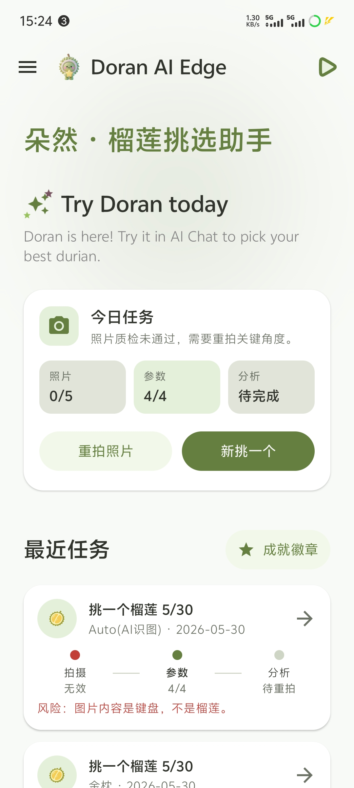 | 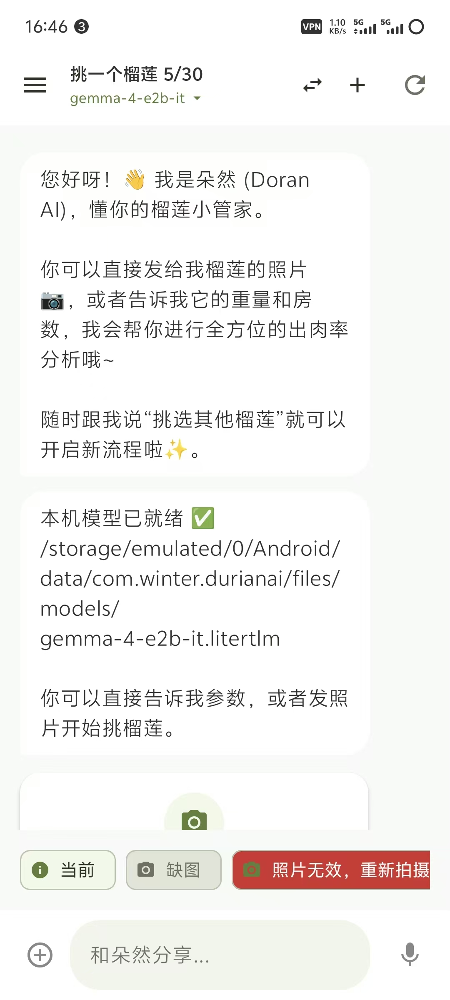 | 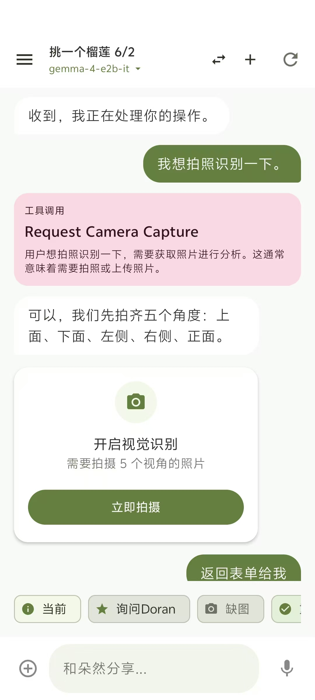 |

| 五角度拍摄 | Gemma4 照片质检 | 模型管理 |
|---|---|---|
| 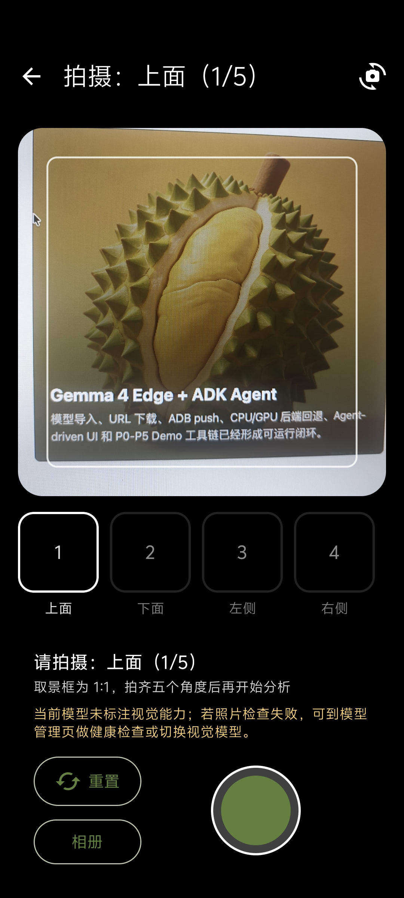 | 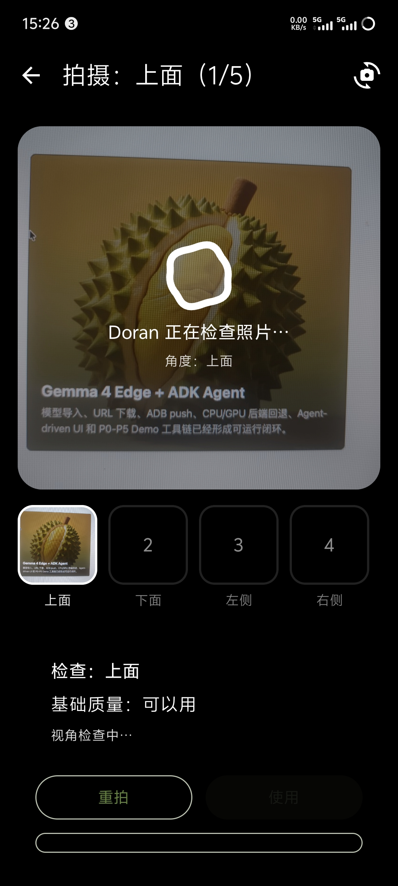 | 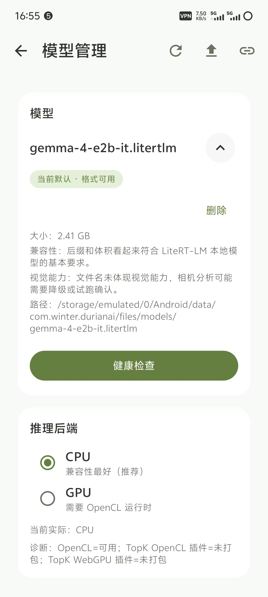 |

| 历史记录 | 数据统计 | 侧边导航 |
|---|---|---|
| 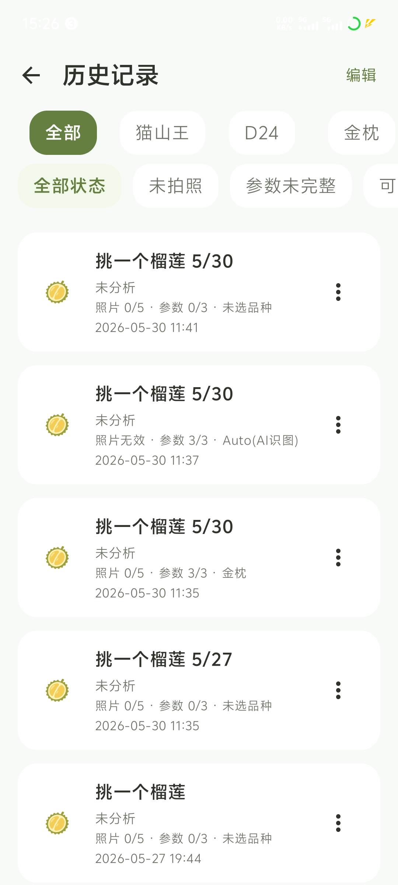 | 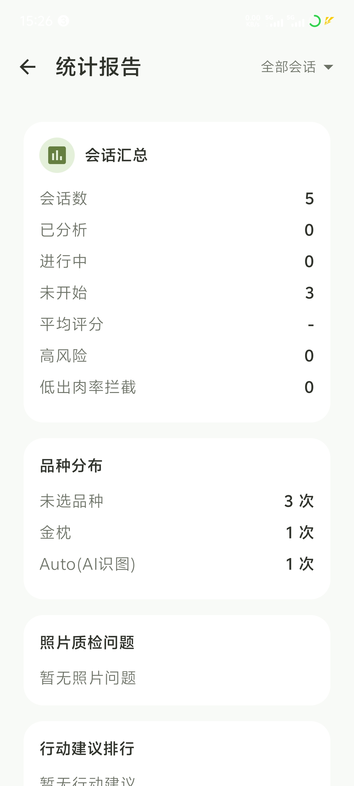 | 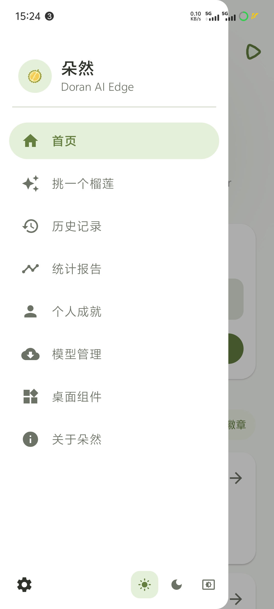 |

| 成就页 | 成就徽章 | 桌面组件 |
|---|---|---|
| 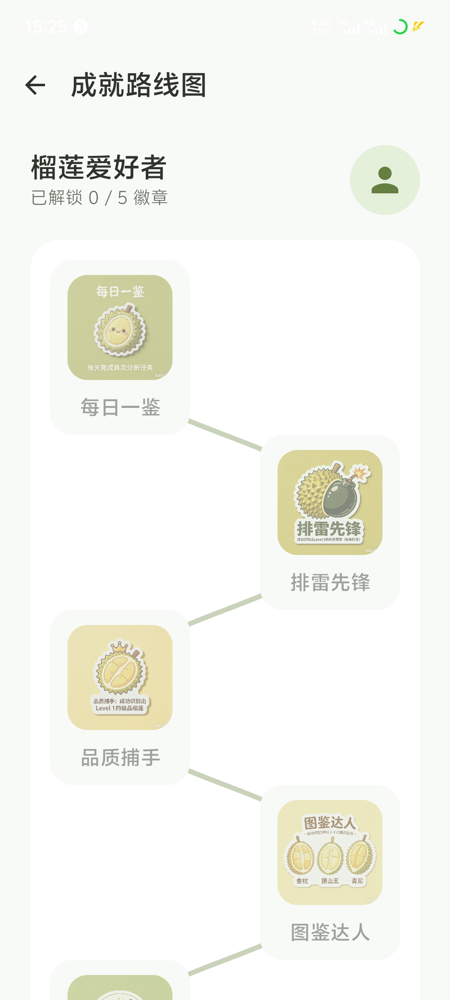 | 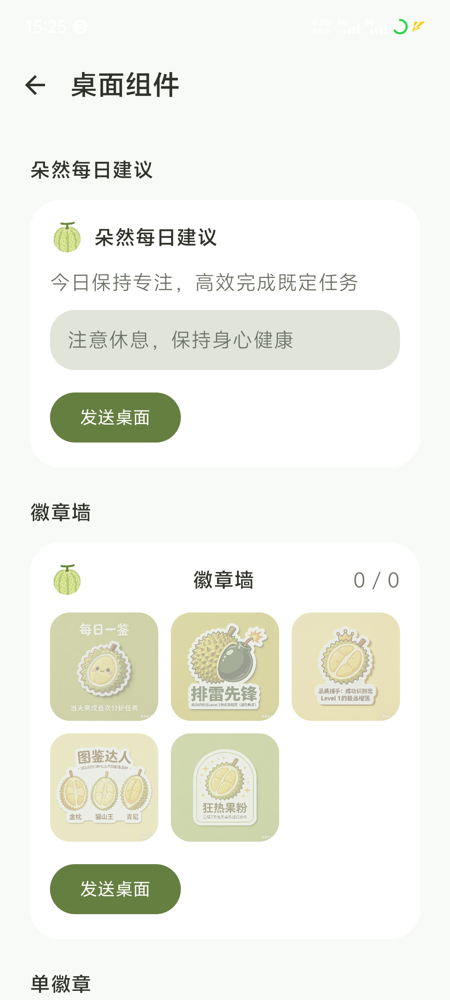 | 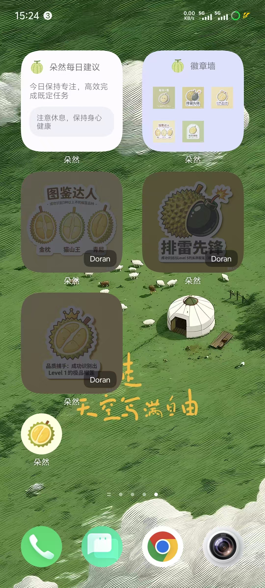 |

| 关于页 | 启动页 |
|---|---|
| 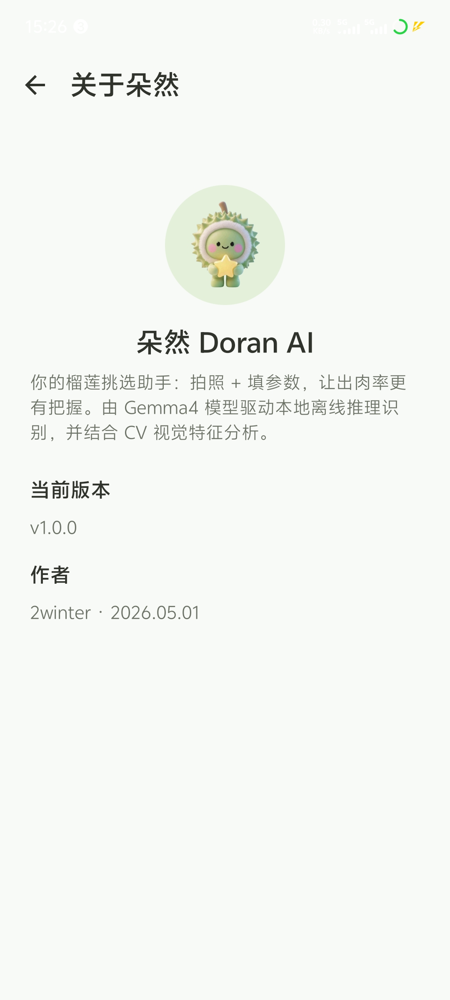 | 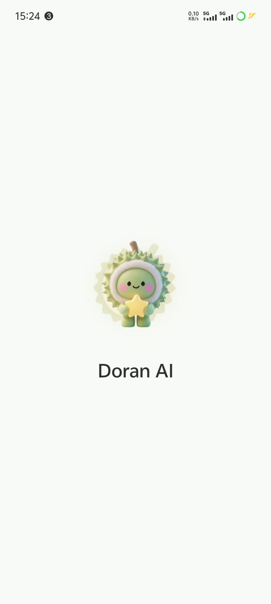 |

### 夜间模式

| 夜间首页 | 夜间初始对话 | 夜间模型管理 |
|---|---|---|
| 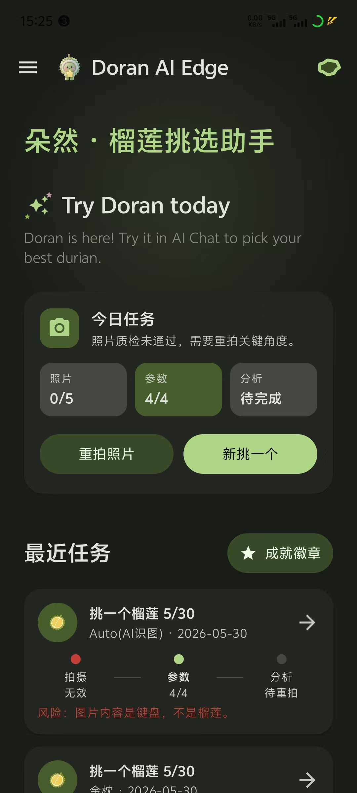 | 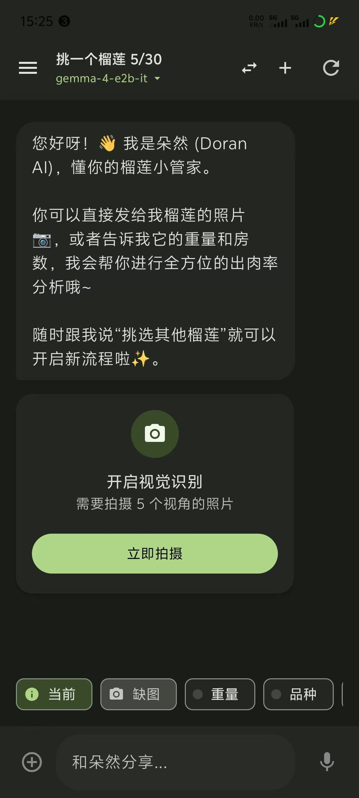 | 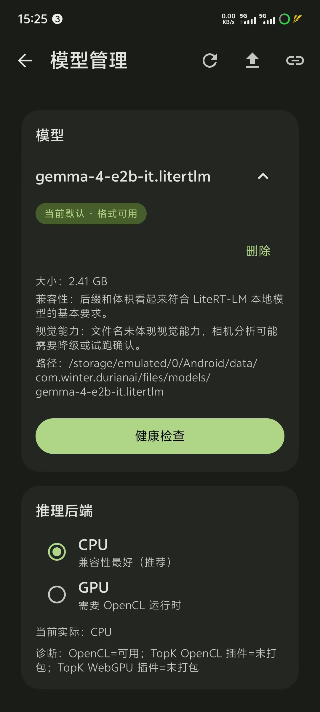 |

| 夜间历史记录 | 夜间数据统计 |
|---|---|
| 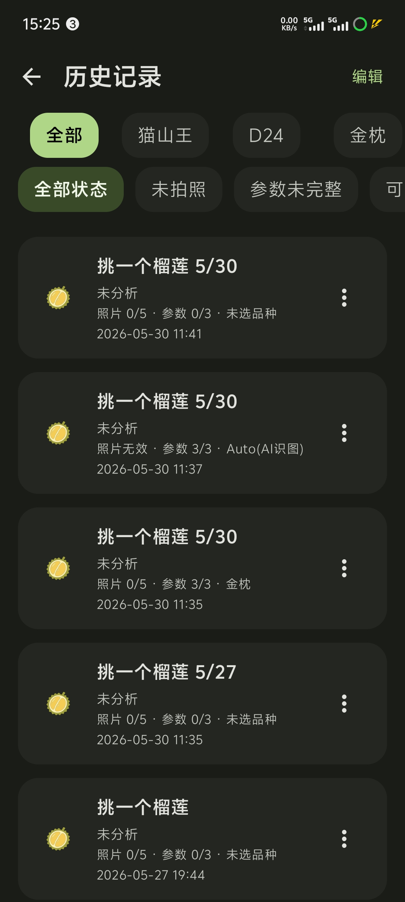 | 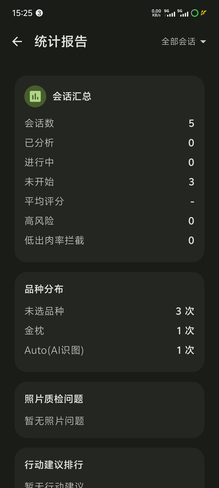 |

## 文档

- [介绍网页](../doran_intro.html)
- [技术报告](../technical_report.md)
- [DoranAI核心代码文档](../code_documentation.md)
- [照片视觉驱动评测方案](../phase2_image_eval_pipeline.md)
- [内置品种先验库](../variety_priors.md)


## 核心源码索引

- `app/src/main/java/com/winter/durianai/data/remote/llm/LlmRepository.kt`：LiteRT-LM 本地推理。
- `app/src/main/java/com/winter/durianai/data/remote/llm/AudioLlmService.kt`：独立进程音频推理。
- `app/src/main/java/com/winter/durianai/data/remote/agent/DoranAdkAgent.kt`：对话 Agent 与工具调用。
- `app/src/main/java/com/winter/durianai/data/remote/agent/DoranAdkAnalysisWorkflow.kt`：P0-P5 ADK 分析工作流。
- `app/src/main/java/com/winter/durianai/ui/screens/agent/AgentChatViewModel.kt`：业务状态机。
- `app/src/main/java/com/winter/durianai/ui/screens/camera/CameraCaptureScreen.kt`：五角度拍照与照片质检。
- `app/src/main/java/com/winter/durianai/ui/screens/nativeui/ModelManagerScreen.kt`：模型管理。

## 构建验证

```bash
./gradlew assembleDebug
```

最近一次验证结果：20260602 BUILD SUCCESSFUL by winter。
