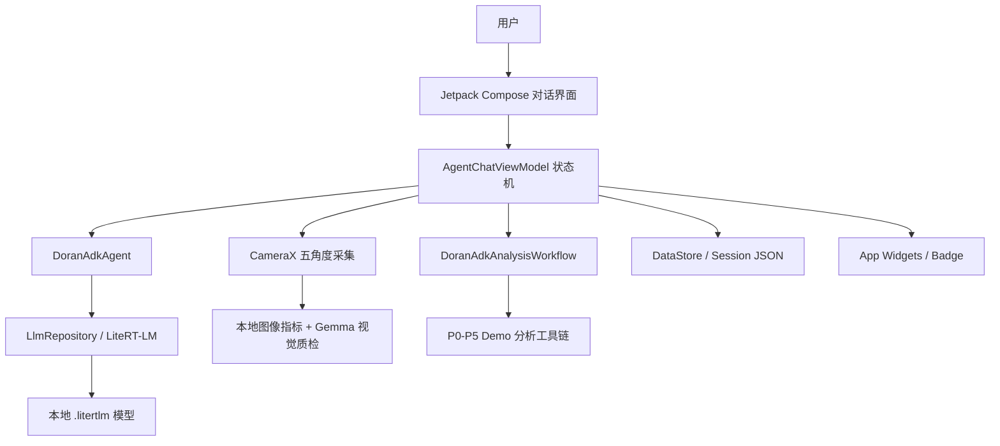

# Doran AI 技术报告

项目：端侧 AI 榴莲挑选小管家  
赛道：Google Gemma 4 Competition - Edge AI  
代码基准：以当前 Android 源码为准 ｜20260602

## 1. 项目概述

Doran AI 是一个运行在 Android 端侧的榴莲挑选 Agent。以“对话 + 动态组件”的方式引导用户完成五角度拍照、重量/房数/形态/品种补全，并使用本地 LiteRT-LM 模型（Gemma4)和 ADK（kotlin）工具调用完成意图解析、照片质检、分析流程编排与购买建议生成。

当前版本的定位不是单纯的图像分类 Demo，而是一个可运行的端侧智能体应用：

- 用户通过自然语言或聊天卡片录入参数（部分必选）。
- CameraX 采集上面、下面、左侧、右侧、正面 5 个角度照片。
- 本地 Gemma 4 / LiteRT-LM 模型用于对话、工具调用协议解析和照片可用性检查。
- ADK Kotlin Agent 负责把模型输出映射为 App 内部动作。
- P0-P5 榴莲评估管线当前为 Demo 模拟/确定性代理计算，保留可替换为真实 CV/轻量模型的工程接口。
- 模型支持本地选择、URL 下载和 ADB push，适合 Demo 阶段快速部署和端侧验证。

## 2. Gemma 4 模型选型理由

本项目面向 Edge AI 赛道，默认选择 Gemma 4 2B Edge 规格的 LiteRT-LM 模型作为 Demo 主模型。根目录当前放置的模型文件为：

```text
gemma-4-E2B-it.litertlm
```

选择 Gemma 4 2B 的原因：

- 端侧可运行性优先：Android 手机的内存、散热和电量约束明显，2B 更适合多数设备稳定运行。
- 延迟和初始化更可控：本项目需要现场完成模型加载、对话、照片质检和报告生成，2B 能降低初始化超时和 OOM 风险。
- 足够覆盖核心任务：榴莲场景主要需要意图识别、工具调用 JSON 生成、照片可用性判断和短报告解释，2B 能支撑完整闭环。
- 更符合 Edge 赛道精神：把模型真正部署到 Android 设备本地，而不是依赖服务器。

其他规格的取舍：

- Gemma 4 4B：适合更高端设备，可作为增强模式，用于更细腻的报告生成或更强的视觉质检。
- Gemma 4 26B MoE：适合云端或工作站推理，不适合作为普通 Android 端侧默认模型。


因此，Doran AI 的策略是：以 2B 端侧模型保证完整可运行闭环，把 4B 作为未来高端设备可选配置，把 26B/31B 留给离线评测、数据标注或服务端增强，未来也有预留支持远程API模式，调试阶段连接过LM Studio本地的gemma模型。

## 3. 真实影响力

榴莲购买是一个高不确定、高客单价、强经验依赖的消费场景。普通用户很难从外观、重量、房型和品种信息中判断出肉率，尤其是在摊位现场，决策时间很短。

Doran AI 选择“端侧 AI”方案，有三个实际价值：

- 离线可用：核心推理在本机完成，适合市场、商超、产地档口等网络不稳定环境。
- 隐私友好：用户拍摄的榴莲照片、购买记录和模型交互不必上传服务器。
- 可扩展：同一套“多角度采集 + 参数补全 + Agent 工具流 + 本地报告”的结构，可以扩展到水果分级、农产品验货、门店质检和消费者导购。

目标用户包括榴莲消费者、代购/团购卖家、水果档口从业者和需要做快速验货的电商运营人员。

## 4. 技术架构

### 4.1 总体结构



### 4.2 技术栈

- Android 原生：Kotlin、Jetpack Compose、Material 3、Navigation Compose。
- 架构：MVVM + StateFlow/UDF，`AgentChatViewModel` 作为核心状态机。
- AI/Agent：Google ADK Kotlin、LiteRT-LM Android、FunctionTool、InMemoryRunner。
- 端侧推理：`.litertlm` 模型，支持 CPU/GPU 后端选择和失败回退。
- 多模态：文本对话、图片输入、音频输入接口；音频推理放在独立进程中执行。
- 摄像头：CameraX 拍摄和预览。
- 数据：DataStore 保存偏好和统计；JSON 文件保存聊天会话、照片状态、分析报告。
- 后台/桌面：AppWidgetProvider、WorkManager、快捷方式、悬浮球服务。

## 5. 核心实现

### 5.1 本地模型管理

模型管理页支持：

- 从系统文件选择器导入 `.litertlm` 文件。
- 从 URL 下载模型到 App 外部私有目录。
- 列出本地模型、切换当前模型、删除模型。
- 执行健康检查，验证模型能否生成中文短文本。
- 开发者模式下选择 CPU/GPU 后端，并展示 OpenCL 与采样插件诊断。

Demo 阶段也提供 `sendModel.sh`，通过 ADB push 将模型放入：

```text
/sdcard/Android/data/com.winter.durianai/files/models/
```

### 5.2 Gemma 4 / LiteRT-LM 推理封装

`LlmRepository` 负责统一管理 Gemma 4 LiteRT-LM Engine：

- 懒加载：进入对话页或需要推理时初始化，避免 App 启动卡顿。
- 模型解析：优先使用用户选择的 active model，其次查找 models 目录下的 `.litertlm`。
- 后端回退：用户选择 GPU 时先检测 OpenCL；GPU 初始化失败或调用超时后回退 CPU。
- 互斥调用：通过 `Mutex` 避免多个推理请求同时占用 Engine。
- 调用日志：记录初始化、文本、视觉、音频调用的耗时、输入输出长度、错误和预览。
- 多模态接口：`getChatCompletion`、`getVisionCompletion`、`getAudioCompletion`。

关键调用代码形态：

```kotlin
val engineConfig = EngineConfig(
    modelPath = file.absolutePath,
    backend = backend,
    visionBackend = if (label == "gpu") Backend.CPU() else backend,
    cacheDir = context.cacheDir.path
)
Engine(engineConfig).apply { initialize() }
```

文本推理使用 `conversation.sendMessage(Contents.of(userPrompt))`。视觉推理使用 `Content.ImageFile(imagePath)`，音频推理使用 `Content.AudioFile(audioPath)`。

音频推理(当前DuranAI版本尚不稳定)额外通过 `AudioLlmService` 跑在 `:audio_lm` 独立进程，降低主进程被重型音频模型拖垮的风险。

### 5.3 Native Function Calling：ADK Agent 与工具调用

`DoranAdkAgent` 是面向用户对话的核心 Agent。它把 LiteRT-LM 封装成 ADK 的 `Model`，并提供一组 FunctionTool：

- `update_durian_parameters`：更新重量、房数、形态、品种。
- `request_input_form`：在聊天流中展示参数表单。
- `request_camera_capture`：请求五角度拍照。
- `start_durian_analysis`：触发分析前置检查和报告流程。
- `restart_selection`：重置当前榴莲任务。

Native Function Calling 的工程落点是 ADK 的 `FunctionTool`、`FunctionDeclaration` 和 `FunctionCall`。项目把 App 原生能力注册成工具：更新参数、请求表单、请求相机、开始分析、重置任务。模型只需要表达工具意图，App 负责执行真正的 Android 原生动作。

因为当前端侧 LiteRT-LM 输出以文本为主，项目实现了一个 JSON 工具调用协议：模型输出 `{"tool_call": ...}` 或 `{"reply": ...}`，App 再解析为 ADK `FunctionCall`。这样既保留了 ADK 的原生函数调用接口，也让端侧模型可以稳定驱动 App 状态。

### 5.4 Agent-Driven UI

聊天消息使用 sealed class 建模：

- 文本消息
- 五角度图片条
- 音频消息
- 相机组件
- 参数表单组件
- P0-P5 分析进度组件
- 结果报告
- 徽章解锁
- 动作按钮和开发日志

Compose 根据消息类型动态渲染不同卡片。Agent 不是只返回文字，而是可以驱动 App 状态改变和 UI 组件出现。例如用户说“帮我开始分析”，Agent 会触发 `start_durian_analysis`；如果照片缺失，界面会自动出现相机入口；如果参数不完整，会自动出现表单。

### 5.5 多模态：五角度照片采集与质检

相机页要求固定采集 5 个角度：

1. 上面
2. 下面
3. 左侧
4. 右侧
5. 正面

每张照片先做快速本地图像质量计算，包括清晰度、亮度、对比度等指标；随后调用本地视觉模型做照片可用性检查，要求输出严格 JSON：

- 是否为榴莲
- 角度是否正确
- 主体是否完整
- 是否遮挡、杂乱、过远、模糊、过暗、过曝或反光

照片质检结果会进入 `PhotoQualityProfile`，后续分析和报告会保留这些风险线索。

### 5.6 P0-P5 分析工作流

当前 `DoranAdkAnalysisWorkflow` 是 Demo 模拟/确定性代理管线，不是完整真实 CV 计算。它使用 ADK 工具调用形式按顺序执行：

- P0 照片质量门禁
- P1 分割与归一化
- P2 刺特征：密度、方向一致性、高度代理
- P3 形态几何：体型、对称性、壳厚代理
- P4 品种先验融合
- P5 融合评分与解释

这部分已经具备完整的工程骨架：进度事件、trace 记录、interim 中间结果、最终 score/level/report、取消/失败处理和报告持久化。后续可以把每个 Tool 内部的模拟逻辑替换为真实 CV、轻量模型或更精细的 Gemma 视觉推理，而不需要重写 UI 和状态机。

### 5.7 品种先验与评分

项目内置 `DurianVarietyProfiles`，覆盖：

- 金枕
- 猫山王
- 黑刺
- 托曼尼
- D24
- 其他/通用

每个品种包含典型重量、理想重量、可食率范围、大房/小房建议、偏好形态、壳厚倾向、刺密度倾向、成熟提示、风险提示和分数偏置。P5 评分会结合：

- 大房数和小房数
- 形态与品种偏好是否匹配
- 重量是否落在典型/理想范围
- 品种先验偏置

分数映射为 Level 1-5，作为报告和徽章系统的核心输入。

### 5.8 会话、报告、徽章和桌面组件

项目已经实现完整的体验闭环：

- 多会话：每次挑选任务有独立 session，可切换和恢复。
- 历史报告：报告保存参数、图片路径、score、level、trace、中间结果和建议。
- 统计：DataStore 记录总次数、低分次数、Level 1 次数、连续使用天数、最近报告。
- 徽章：根据报告解锁品质捕手、排雷先锋、每日一鉴、狂热果粉、图鉴达人等。
- 桌面组件：每日建议、最新报告和徽章组件可同步更新。
- 悬浮球：提供快捷入口，快速唤起。

## 6. 项目亮点

### 现场价值

Doran AI 面向真实购买决策，解决“看不懂榴莲外观、难估出肉率、现场决策难”的问题。端侧运行提升隐私和现场可用性，固定采集流程降低了单张图误判风险。

### 端侧智能体

项目不是简单调用模型，而是把 Gemma 4 / LiteRT-LM 接入 ADK Agent：

- 本地模型懒加载与健康检查。
- CPU/GPU 后端管理和回退。
- 文本、视觉、音频接口统一封装。
- ADK FunctionTool / FunctionDeclaration / FunctionCall 把本地模型变成可驱动 App 状态的 Agent。
- P0-P5 工作流用 FunctionTool 形成可解释、可追踪、可替换的分析管线。

### 完整闭环

Demo 可运行路径完整：

1. 导入或下载 `.litertlm` 模型。
2. 进入对话页，等待本地模型加载。
3. 通过自然语言或表单补参数。
4. 拍摄或选择五角度照片。
5. 本地模型检查照片可用性。
6. 触发 P0-P5 分析进度。
7. 生成报告、保存历史、更新统计/徽章/桌面组件。

边缘情况处理包括：模型缺失提示、初始化超时、GPU 不可用回退、照片无效、参数不完整、分析取消和分析失败。

### 交互创新

创新点在于把榴莲挑选这个强经验问题转化为端侧 Agent 工作流：

- 多角度拍摄不是简单上传照片，而是作为结构化任务状态进入分析。
- Agent 可以主动下发表单和相机组件。
- 本地模型参与工具调用和照片质检，减少服务器依赖。
- P0-P5 评估被设计为可解释的“视觉管线 + 品种先验 + 报告生成”，不是黑箱打分。


7.当前边界与后续计划

当前已经完成：

- Android 原生 App 主体。
- ADK Agent 对话与工具调用。
- 本地 LiteRT-LM 模型管理和推理封装。
- 模型导入、URL 下载、ADB push Demo 支持。
- CameraX 五角度采集。
- Gemma 视觉照片质检。
- P0-P5 Demo 分析流程、报告、会话、统计、徽章、组件。

当前仍为 Demo/待更新支持：

- P1-P3 的真实图像分割、刺特征、几何测量尚未接入真实 CV 算法。
- P5 融合评分当前主要基于参数、品种先验和照片质检代理信息。
- 视觉模型能力依赖用户导入的 `.litertlm` 模型是否支持图像输入。

后续计划：

- 将 P1-P3 替换为端上轻量视觉模型或传统 CV 特征提取。
- 构建真实榴莲样本数据集，标注品种、重量、开果结果、出肉率和照片质量。
- 用真实开果结果校准 `DurianVarietyProfiles` 和评分权重。
- 把 P0-P5 trace 做成可导出评测记录，便于比赛复现和后续模型迭代。

## 8. Duran小管家的自我总结（此处 wink！）

Doran AI 当前版本已经具备一个 Edge AI 作品所需的端侧闭环：本地模型、Agent 工具调用、多模态输入、可运行 Demo、状态持久化和可解释分析报告。虽然核心图像出肉率计算仍处于 Demo 模拟阶段，但项目已经把未来真实 CV 模块需要接入的位置、数据结构、UI 进度和报告链路搭好，具备清晰的工程延展性和真实场景价值。
